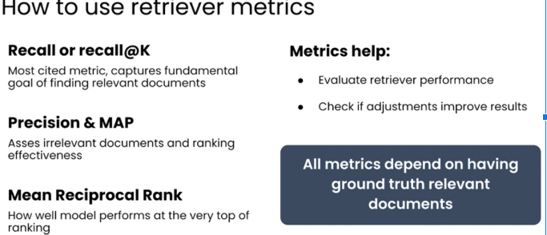

# RAG Notes

## Table of Contents
- [1. Introduction](#introduction)
- [2. Keyword Search](#keyword-search)
- [3. Semantic Search](#semantic-search)
- [4. Embedding Models](#embedding-models)
- [5. Hybrid Search](#hybrid-search)
- [6. Evaluating Retrieval](#evaluating-retrieval)
- [7. Approximate Nearest Neighbour Algorithm](#approximate-nearest-neighbour-algorithm)
- [8. Chunking](#chunking)
- [9. Cross Encoders vs ColBert](#cross-encoiders-vs-colbert)
- [10. ReRanking](#reranking)
- [11. Query Parsing](#query-parsing)
## Introduction

I've created this markdown on Retrieval-Augmented Generation (RAG) to help deepen my own understanding and support future implementation work. These notes aim to break down key concepts, strategies, and tools in a way that's practical and easy to reference. If you have been lucky enough to stumble upon this markdown , then be thankful Bish.

## Keyword Search

### Simple Scoring

Consider the following Token/Doc Matrix.

*Figure 2.A: Simple Scoring Matrix*

Scoring is performed by giving Documents in which the token exists a point. In Figure  2.A, Doc1 contains all 5 tokens so it is deemed the most relevant.

### Frequency Baased Scoring

Simple Scoring undermines the fact that the document might just have a simple mention of the word and the token might not be thoroughly condensed into it. Hence TF-Based Scoring can be utilized

*Figure 2.B: TF-Based-Scoring vs Simple Scoring*

TF-Based Scoring has an issue where even if documents have more keywords, what if the documents were just longer than each other and hence had more keywords. Also it doesnt distinguish between common filler words like 'the' and 'a' and meaningful words.

### TF-IDF

To Account for this , we can amend the score of the Token, so that instead of giving a score of 1 we give it a score of the log of the inverted percentage of the number of times the token appears in documents

*Figure 2.C: TF-IDF-Based-Scoring*

Thus an adjusted score can be utilized to get the most relevant documents.

*Figure 2.D: TF vs TF-IDF*

*Figure 2.E: TF-IDF-Based-Scoring-Details*

Via this method Documents with rare key words score higher than documents with common words for retrieval.

### BM25

BM25 is the standard keyword search algorithm in production retrievers. It has better performance , the same cost and more flexibility that TF-DF

*Figure 2.F: BM-25-Introduction*

#### Main assumptions of BM25

- [Term Frequency Saturation] A Document that mentions a key word alot more than another isnt more important more linearly or greater.

- [Document Length Normalization] TF-IDF severely punishes long documents. It is better to implement a smaller penalty.

Hence BM25 has two tunable parameters

- Term Frequency Saturation : controls how much term frequency influences the score. Higher values increase the impact of term frequency; lower values reduce it.

- Length Normalization : The degree of normalization for document length. Degree of penalization for longer documents.

## Semantic Search

Keyword Search is fast and interpretable but limited to surface level matches. Sematic Search enables deeper language understanding and is crucial in RAG systems for retrieving contextually relevant documents even if exact words dont match.

- Embedding Models map tokens to a location space. This location is represented by a vector
- Embedding Models will map associated tokens nearby. For example food and cuisine will be embedded close to eachg other and words such as cat and trombone would be further away
- The vector space has many dimensions to capture more nuanced relationships between words.

Differement metrics are used to determine closeness of points in vector space in the context for semantic search

- Cosine Similarity : find similarity in meaning regardless of vector length
- Euclidean Distance : Find embeddings that are close in space
- Dot Product : Fast retrieval with large vector stores which are normalized.

This is how Semantic Search is conducted:

- Chunk and Embed : Break each document into smaller chunks (paragraphs or passages) and embed each chunk using a semantic embedding models. For Example OpenAI Embeddings and Sentence-BERT

- Compare Chunks to Query : Embed the user query and compare it to each chunk across all documents using a similarity metric (e.g. cosine similarity). This helps match even if the relevant info is deep inside a long document.

- Aggregate and Rank Documents : Aggregate the similarity scores per document 
(e.g. use the max or average of its chunk scores) to identify the most relevant documents overall.

*Figure 3.A: Semantic Search Process*

## Embedding Models

Embedding Models are trained using a strategy called contrastive learning , which relies on positive and negative pairs of text
    - "Good Morning" and "Hello" is an example of a positive pair
    - "Good Morning" and "That's a noisy trombone" is an example of a negative pair

Each text input is passed through the embedding modelto generate an initial vector representation. At the start , model's parameters are untrained so vector placements are effectively randomly. The model evaluates how close the vectors of positive pairs are and how far apart the negiatve pairs are. A contrastive loss function (such as cosine contrastive loss or triplet loss) measures the alignment between these vector placements and the label expectations. Based on the loss, the model's parameters are updated using backpropogation to better cluster semantically similiar texts and separate dissimiliar ones in the embedding space. The training loop continues iteratively until the model lears to generate meaningful vector representations that  reflect semantic similarity.

*Figure 4.A: Contrastive Training Process*

## Hybrid Search

Hybrid search combines keyword search, semantic search, and metadata filtering to overcome the limitations of each method. Keyword search excels at exact term matching but struggles with synonyms or context, which semantic search handles by understanding meaning and intent. However, semantic search can return loosely related results, which keyword matching helps anchor with precision. Metadata filtering adds structure by narrowing results based on predefined attributes, ensuring relevance even when the text content alone is ambiguous.

Documents are retrieved using both keyword and semantic search methods. The results are first filtered using metadata to ensure they meet specific criteria. Then, the filtered results from both methods are merged into a single ranked list—typically using Reciprocal Rank Fusion (RRF) to balance relevance from both search types.

*Figure 5.A: Hybrid Search Process*

## Evaluating Retrieval

1. The key components in evaluating retrieval quality metrics are :

- Prompt: The specific query or input used for retrieval
- Ranked Results : The lsit of documents returned, ordered by predicted relevance
- Ground Truth : The set of documents manually labelled as relevant or irrelevant for that query.

2. Precision and Recall

Retrievers are designed to find the most relevant documents for a given prompt. To measure their effectiveness, the retrieved and ranked results are compared against a ground truth set—documents that have been labeled as relevant or not. This comparison helps determine how well the retriever is performing. Having accurate and well-labeled ground truth data is crucial for reliable evaluation and ongoing improvement.

To measure how well a retriever is performing, we compare its results to a ground truth set—documents that have been labeled as relevant or not. This helps us evaluate the quality of the retrieval using metrics like precision and recall. Precision tells us how many of the retrieved documents were actually relevant, while recall shows how many of the relevant documents the retriever was able to find. Together, these metrics help balance accuracy and coverage when assessing a search system.

Below is a Confusion Matrix:

|                  | **Retrieved**       | **Not Retrieved**   |
| ---------------- | ------------------- | ------------------- |
| **Relevant**     | True Positive (TP)  | False Negative (FN) |
| **Not Relevant** | False Positive (FP) | True Negative (TN)  |

- True Positive (TP): Relevant documents that were correctly retrieved.
- False Positive (FP): Non-relevant documents that were incorrectly retrieved.
- False Negative (FN): Relevant documents that were not retrieved.
- True Negative (TN): Non-relevant documents that were not retrieved (often not used in precision/recall).

Formulas:
- Precision = TP / (TP + FP)

→ Of all the documents retrieved, how many were actually relevant?

- Recall = TP / (TP + FN)

→ Of all the relevant documents, how many were successfully retrieved?

3. Important Retrieval Metrics

    - Precision@K: Measures the proportion of relevant documents within the top K retrieved results. For example, if 3 out of the top 5 documents are relevant, then Precision@5 = 0.6. This metric is especially useful when users are likely to examine only the top-ranked results, as it focuses on immediate relevance rather than overall recall.

    - MAP@K (Mean Average Precision at K): Calculates the average precision at each point where a relevant document appears, and then takes the mean across all relevant documents within the top K. This provides a more nuanced view than Precision@K, as it considers both the number and positions of relevant documents. MAP@K rewards systems that retrieve relevant documents earlier in the ranked list, and is useful for tasks where multiple relevant documents may exist per query.

    - Reciprocal Rank (RR): The reciprocal of the rank at which the first relevant document appears (i.e., 1 / rank). If the first relevant result is ranked third, RR = 1/3. This sharply penalizes systems that place the first relevant result deep in the list, making it ideal for applications where finding one correct answer quickly is the goal (e.g., question answering).

    - Mean Reciprocal Rank (MRR): Averages the Reciprocal Rank across many queries to evaluate a system’s ability to retrieve relevant results early, consistently. MRR is particularly effective for evaluating single-answer scenarios, where the position of the first correct result is critical to user experience.

*Figure 6.A: Important Retrieval Metrics*

## Approximate Nearest Neighbour Algorithm

1. K - Nearest Neighbors

In KNN, both documents and the query prompt are converted into embeddings (vectors) to represent their meaning numerically. The system then computes similarity scores—often using distance metrics like cosine similarity—between the query vector and each document vector. These documents are ranked based on similarity, and the top K most relevant ones are returned. While this method is effective, it relies on a brute-force K-Nearest Neighbors (KNN) approach, which doesn’t scale well due to the high computational cost of comparing the query against all vectors in the dataset.

2. Introducing ANN (NSW [Navigable Small World])

- Approximate Nearest Neighbor (ANN) is significantly faster than KNN
- Uses specialized data structures (e.g. trees, graphs) for efficient search
- May not return the exact nearest neighbors, but close enough

Approximate Nearest Neighbor (ANN) search works by representing each document or vector as a node in a high-dimensional space. These nodes are then connected to their nearest neighbors, forming a proximity graph that enables efficient navigation. During a search, the algorithm begins at a random node and iteratively moves to the neighbor that is closest to the query vector. This greedy approach continues until no closer neighbor can be found, effectively converging on a near-optimal match. By avoiding exhaustive comparisons and relying on local navigation, ANN significantly reduces search time while maintaining high recall.

*Figure 7.A: Search Algorithm*

3. HNSW

- Hierarchical zooming: HNSW builds a multi-layer proximity graph so the search “zooms in” from coarse to fine. Hig
her layers are sparser and let you quickly get close to the query, while the bottom layer has the full graph for precise retrieval.
- Entry point & search flow: Search begins at the current entry point in the topmost layer (not a completely fresh random start each time), and performs a greedy walk to find the best candidate. That candidate is used as the starting point in the next lower layer, refining progressively.
- Logarithmic-like efficiency: Because higher layers are sparser and reduce the search space early, average search time grows sublinearly (often described as logarithmic in practice) with dataset size, yielding fast queries even with many vectors—while still maintaining high recall.

4. Layer Structure

- Layer 3 (top): Very sparse, e.g., ~10 hubs. Provides a rough “global” starting area.
- Layer 2: Intermediate density, e.g., ~100 nodes; refines the region of interest.
- Layer 1 (base): Full graph with all ~1000 vectors; final detailed search to retrieve nearest neighbors.

5. Search Procedure

- Start from top layer's entry point.
- Search starts here with a random entry point, Quickly narrows down to a promising candidate
- Refines search using proximity graph starting from Layer 3’s best candidate. Perform greedy descent through layers (only keeping closer nodes). 
- Performs detailed search from Layer 2’s best candidate. At base layer, use bounded best-first search (efSearch) for accurate nearest neighbors. 
- Return top-k results.

6. Index Construction

- Each vector gets a randomly assigned max layer (exponentially distributed).
- Inserted top-down, connecting to neighbors at each level.
- Maintains entry point and layer connectivity dynamically.

7. Parameter

- M: Maximum number of connections per node (controls graph connectivity). Larger M → better recall / slower indexing and more memory.
- efConstruction: Size of the dynamic candidate list used during index building; higher values yield a higher-quality graph (better recall) at the cost of slower construction.
- efSearch: Size of the candidate list during query time; larger gives higher recall but slower queries.
- Recall vs speed trade-off: Tuning efSearch and M lets you balance latency versus accuracy; typical practice is to set efConstruction relatively high once, and adjust efSearch per query workload.

## Chunking

1. Chunking

Chunking involves breaking longer text into smaller, manageable segments. This is necessary because embedding models have input size limits. Beyond that, chunking improves retrieval quality by allowing the system to focus on more fine-grained, relevant content. Effective chunking captures self-contained ideas—such as paragraphs or logical units—making each chunk meaningful on its own.

2. What should the chunk size be ?

Chunks that are too small can lose important context, while chunks that are too large risk exceeding model limits or diluting topic focus. Striking the right balance is essential—common chunk sizes range from 100 to 500 tokens, often with some overlap to preserve continuity between segments.

3. There are other forms of chunking such as **overlapping chunking** and **recursive character splitting**

- Overlapping Chunking
    - Overlapping chunking creates fixed-size chunks that include overlapping tokens from previous chunks. This approach helps preserve context across chunk boundaries, making it especially effective for tasks like question answering, where understanding surrounding information is crucial. However, it does increase the total token count due to repeated content, which can introduce some redundancy during retrieval. Overlapping chunking is particularly well-suited for unstructured documents, where important information may not be neatly contained within isolated sections.

- Recursive Character splitting

    - Recursive Character Text Splitting breaks text at logical boundaries—such as paragraphs, sentences, or even words—prioritizing semantic coherence at each level. It works recursively: if a chunk exceeds the token limit, it attempts to split at the next smaller boundary. This flexible, adaptive approach preserves meaning more effectively than fixed-size chunking, making it especially valuable for long-form content, code documentation, and semantically rich articles. However, because chunk sizes vary, it can complicate batch processing and reduce uniformity. It also tends to be more computationally intensive, but the improved retrieval quality often outweighs the cost—especially in applications where nuanced understanding matters.

4. Advanced forms of chunking

- Move through document
    - "Move Through Document" chunking processes text sentence by sentence, dynamically building chunks based on semantic similarity. Each sentence is converted to a vector and compared to the current chunk using cosine distance; if the distance is below a set threshold, the sentence is added. When the distance exceeds the threshold, a new chunk is started. This method closely follows the author’s train of thought, creating smart, context-aware boundaries that boost both recall and precision. However, it can be computationally expensive, especially for large documents.

*Figure 8.A: Move Through Chunking*

- Language based chunking
    - LLM-assisted chunking involves prompting a language model to segment a document into meaningful chunks. The prompt can include instructions such as keeping related concepts together, adding breaks when a new topic begins, or aligning chunks with natural discourse boundaries. This approach leverages the model’s understanding of language and context to create high-quality, semantically coherent chunks. While more resource-intensive than basic heuristics, it performs well and is becoming increasingly cost-effective with advancements in model efficiency. It’s especially useful for complex or unstructured content where rule-based chunking falls short.

*Figure 8.B: Move Through Chunking*

- Context aware chunking [not a chunking strategy but an enhancement. A good first improvement]
    - Context-aware chunking is not a standalone chunking strategy, but rather an enhancement—often a first improvement—to existing chunking methods. It uses an LLM to inject or retain relevant surrounding context, such as headings, section titles, or neighboring chunks, either during or after chunk creation. By avoiding isolated chunks and instead enriching them with broader context, it helps models better understand each chunk’s position within the document’s structure (e.g., chapter, topic flow). This significantly improves downstream tasks like retrieval or reasoning, especially in Retrieval-Augmented Generation (RAG) pipelines. The result is more accurate, relevant responses from the LLM, thanks to a clearer understanding of the chunk’s meaning and role.

## Cross Encoders vs ColBert

1. Bi-Encoder
    - Seperate Semantic Vectors
        - Documents and queries are emedded independelty using the same embedding model allowing for efficient large scale retrieval
    - ANN Search
        - Uses ANN search to quickly find document vectors close to the query vector
        - Enables fast retrieval from large vector stores
    - Document Vectors are Pre-Computed
        - All document embedding are pre-calculated and stored in a vector db
        - At query time, only the query needs to be embedded speeding up retrieval

*Figure 9.A: Bi Encoder Diagram*

2. Cross-Encoder
    - Concatenate Documents and Prompts
        - Each document is paired with the prompt and the two are concatenated into a single input
        - This joint input is fed into the model one document at at time
    - Feed to Cross Encoder
        - The cross encoder uses a transformer to deeply model interactions between the prompt and the documents
        - It considers full attention across both inputs capturing fine grained relevance
    - Generate Relevancy Score
        - The model outputs a single relevance score (between 0 and 1) for each document-prompt pair
        - Typically used in re-ranking after a Bi-Encoder retrieves top-k candidates

*Figure 9.B: Cross Encoder Diagram*
        
3. ColBert

- Split the difference between Bi and Cross Encoders
    - Combines Bi-Encoder efficiency with Cross-Encoder expressiveness.
    - Documents are pre-encoded, but token-level interactions are computed at query time
    - Instead of a single embedding per document or chunk, each token gets its own vector, retain the contextual meaning of each word or phrase within the document,
    while still allowing fast retrieval.
    - This enables fine-grained scoring without the full cost of cross-attention.
- Colbert Scoring
    - At retrieval time, each query token vector finds its most similar document token vector (e.g., using max similarity).
    - Allows query tokens to match directly with their most relevant counterparts in the document — leading to richer, more accurate scoring.
    - The final relevance score is computed by aggregating these best-match scores, typically via sum or average.
    - This approach enables late interaction—capturing deep semantic alignment without the cost of full cross-attention between prompt and document.
- Benefits 
    - Faster than Cross Encoders, since documents are pre-encoded.
    -  More accurate than Bi-Encoders, since token-level matching captures richer semantics.
    - Well-suited for large-scale retrieval with high accuracy.

*Figure 9.B: ColBERT Example; Relevant Documents with the highest MaxSim scores are retrieved*

## Reranking

- Highly Computationally expensive Models can be used to re-rank relevancy after the Top-k Documents are retrieved 
    - Cross Encoder Re-Rankers
        - Cross-encoders jointly encode the query and document, enabling fine-grained interactions and yielding superior relevance scores.
        - They are computationally expensive, so they are typically used after an initial fast retrieval stage (e.g., with a bi-encoder or vector search).
        - This two-stage architecture allows a quality–latency tradeoff, where efficiency is maintained without compromising accuracy.
        - Adds minor latency, but often significantly boosts ranking performance.

    - LLM Based Scoring
        - Large Language Models can be used to evaluate and rank document relevance based on deeper semantic understanding.
        - Often used as a final re-ranking step when precision is critical, especially in high-value applications like legal or medical search.
        - Can leverage prompt-based scoring, generation-based signals, or fine-tuned classification outputs.
        - Comes with high inference cost, but provides strong relevance signals.

*Figure 10.A: LLM Search*

## Query Parsing

*Figure 10.A: Query Rewriting*

- Sometimes an LLM can be utilied rewrite the initial query. There are several ways to do this.

    - Gliner
        GLiNER is a lightweight zero-shot/few-shot NER model built on top of a language model like BERT or T5. You simply provide a list of entity types (e.g., "Person", "Organization"), and it extracts matching entities from text—no domain-specific fine-tuning required. It’s highly flexible and well-suited for information extraction from unstructured text across diverse domains. For example, given the types ["Person", "Organization"], it can extract "Elon Musk" and "Tesla" from a sentence. GLiNER is ideal for scenarios where traditional NER models would require retraining.
    - Hyde
        HyDE (Hypothetical Document Embeddings) is a semantic search technique that improves retrieval by generating a hypothetical answer to the query using an LLM. Instead of embedding the query directly, the model embeds this generated answer—assuming relevant documents will resemble the answer more than the original query. This approach boosts recall, especially for vague or under-specified queries.
        Example: For “Why is the sky blue?”, HyDE generates a short explanation about Rayleigh scattering and retrieves documents similar to that.

*Figure 10.B: How GLINER works*