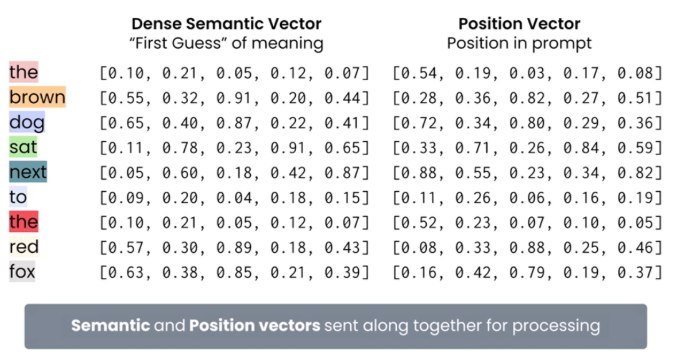

# RAG Notes

## Table of Contents

- [1. Introduction](#introduction)
- [2. Keyword Search](#keyword-search)
- [3. Semantic Search](#semantic-search)
- [4. Embedding Models](#embedding-models)
- [5. Hybrid Search](#hybrid-search)
- [6. Evaluating Retrieval](#evaluating-retrieval)
- [7. Approximate Nearest Neighbour Algorithm](#approximate-nearest-neighbour-algorithm)
- [8. Chunking](#chunking)
- [9. Cross Encoders vs ColBert](#cross-encoiders-vs-colbert)
- [10. ReRanking](#reranking)
- [11. Query Parsing](#query-parsing)
- [12. Transformer Architecture](#transformer-architecture)
- [13. Prompt Engineering](#prompt-engineering)
- [14. Hallucinations in RAGs](#hallucinations-in-rags)
- [15. Agentic RAGs](#agentic-rags)
- [16. Fine Tuning vs Rags](#fine-tuning-vs-rags)
- [17. Evaluating LLM Performance](#evaluating-llm-performance)
- [18. Prompt Engineer Advanced Techniques](#prompt-engineer-advanced-techniques)
- [19. LLM Sampling Strategies](#llm-sampling-strategies)
- [20. Choosing the Right LLM](#choosing-the-right-llm)
- [21. Challenges with Production](#challenges-with-production)
- [22. Implementing Rag Evaluation](#implemeting-rag-evaluation)
- [23. Latency vs Response Quality](#latency-vs-response-quality)
- [24. Customized Evaluation](#customized-evaluation)
- [25. Logging, Monitoring and Observability](#logging-monitoring-and-observability)
- [26. Primary RAG Cost Drivers](#primary-rag-cost-drivers)
- [27. Security](#security)
- [28. Quantization](#quantization)

## Introduction

I've created this markdown on Retrieval-Augmented Generation (RAG) to help deepen my own understanding and support future implementation work. These notes aim to break down key concepts, strategies, and tools in a way that's practical and easy to reference. If you have been lucky enough to stumble upon this markdown , then be thankful Bish.

## Keyword Search

### Simple Scoring

Consider the following Token/Doc Matrix.

*Figure 2.A: Simple Scoring Matrix*

Scoring is performed by giving Documents in which the token exists a point. In Figure  2.A, Doc1 contains all 5 tokens so it is deemed the most relevant.

### Frequency Baased Scoring

Simple Scoring undermines the fact that the document might just have a simple mention of the word and the token might not be thoroughly condensed into it. Hence TF-Based Scoring can be utilized

*Figure 2.B: TF-Based-Scoring vs Simple Scoring*

TF-Based Scoring has an issue where even if documents have more keywords, what if the documents were just longer than each other and hence had more keywords. Also it doesnt distinguish between common filler words like 'the' and 'a' and meaningful words.

### TF-IDF

To Account for this , we can amend the score of the Token, so that instead of giving a score of 1 we give it a score of the log of the inverted percentage of the number of times the token appears in documents

*Figure 2.C: TF-IDF-Based-Scoring*

Thus an adjusted score can be utilized to get the most relevant documents.

*Figure 2.D: TF vs TF-IDF*

*Figure 2.E: TF-IDF-Based-Scoring-Details*

Via this method Documents with rare key words score higher than documents with common words for retrieval.

### BM25

BM25 is the standard keyword search algorithm in production retrievers. It has better performance , the same cost and more flexibility that TF-DF

*Figure 2.F: BM-25-Introduction*

#### Main assumptions of BM25

- [Term Frequency Saturation] A Document that mentions a key word alot more than another isnt more important more linearly or greater.

- [Document Length Normalization] TF-IDF severely punishes long documents. It is better to implement a smaller penalty.

Hence BM25 has two tunable parameters

- Term Frequency Saturation : controls how much term frequency influences the score. Higher values increase the impact of term frequency; lower values reduce it.

- Length Normalization : The degree of normalization for document length. Degree of penalization for longer documents.

## Semantic Search

Keyword Search is fast and interpretable but limited to surface level matches. Sematic Search enables deeper language understanding and is crucial in RAG systems for retrieving contextually relevant documents even if exact words dont match.

- Embedding Models map tokens to a location space. This location is represented by a vector
- Embedding Models will map associated tokens nearby. For example food and cuisine will be embedded close to eachg other and words such as cat and trombone would be further away
- The vector space has many dimensions to capture more nuanced relationships between words.

Differement metrics are used to determine closeness of points in vector space in the context for semantic search

- Cosine Similarity : find similarity in meaning regardless of vector length
- Euclidean Distance : Find embeddings that are close in space
- Dot Product : Fast retrieval with large vector stores which are normalized.

This is how Semantic Search is conducted:

- Chunk and Embed : Break each document into smaller chunks (paragraphs or passages) and embed each chunk using a semantic embedding models. For Example OpenAI Embeddings and Sentence-BERT

- Compare Chunks to Query : Embed the user query and compare it to each chunk across all documents using a similarity metric (e.g. cosine similarity). This helps match even if the relevant info is deep inside a long document.

- Aggregate and Rank Documents : Aggregate the similarity scores per document 
(e.g. use the max or average of its chunk scores) to identify the most relevant documents overall.

*Figure 3.A: Semantic Search Process*

## Embedding Models

Embedding Models are trained using a strategy called contrastive learning , which relies on positive and negative pairs of text
    - "Good Morning" and "Hello" is an example of a positive pair
    - "Good Morning" and "That's a noisy trombone" is an example of a negative pair

Each text input is passed through the embedding modelto generate an initial vector representation. At the start , model's parameters are untrained so vector placements are effectively randomly. The model evaluates how close the vectors of positive pairs are and how far apart the negiatve pairs are. A contrastive loss function (such as cosine contrastive loss or triplet loss) measures the alignment between these vector placements and the label expectations. Based on the loss, the model's parameters are updated using backpropogation to better cluster semantically similiar texts and separate dissimiliar ones in the embedding space. The training loop continues iteratively until the model lears to generate meaningful vector representations that  reflect semantic similarity.

*Figure 4.A: Contrastive Training Process*

## Hybrid Search

Hybrid search combines keyword search, semantic search, and metadata filtering to overcome the limitations of each method. Keyword search excels at exact term matching but struggles with synonyms or context, which semantic search handles by understanding meaning and intent. However, semantic search can return loosely related results, which keyword matching helps anchor with precision. Metadata filtering adds structure by narrowing results based on predefined attributes, ensuring relevance even when the text content alone is ambiguous.

Documents are retrieved using both keyword and semantic search methods. The results are first filtered using metadata to ensure they meet specific criteria. Then, the filtered results from both methods are merged into a single ranked list—typically using Reciprocal Rank Fusion (RRF) to balance relevance from both search types.

*Figure 5.A: Hybrid Search Process*

## Evaluating Retrieval

1. The key components in evaluating retrieval quality metrics are :

- Prompt: The specific query or input used for retrieval
- Ranked Results : The lsit of documents returned, ordered by predicted relevance
- Ground Truth : The set of documents manually labelled as relevant or irrelevant for that query.

2. Precision and Recall

Retrievers are designed to find the most relevant documents for a given prompt. To measure their effectiveness, the retrieved and ranked results are compared against a ground truth set—documents that have been labeled as relevant or not. This comparison helps determine how well the retriever is performing. Having accurate and well-labeled ground truth data is crucial for reliable evaluation and ongoing improvement.

To measure how well a retriever is performing, we compare its results to a ground truth set—documents that have been labeled as relevant or not. This helps us evaluate the quality of the retrieval using metrics like precision and recall. Precision tells us how many of the retrieved documents were actually relevant, while recall shows how many of the relevant documents the retriever was able to find. Together, these metrics help balance accuracy and coverage when assessing a search system.

Below is a Confusion Matrix:

|                  | **Retrieved**       | **Not Retrieved**   |
| ---------------- | ------------------- | ------------------- |
| **Relevant**     | True Positive (TP)  | False Negative (FN) |
| **Not Relevant** | False Positive (FP) | True Negative (TN)  |

- True Positive (TP): Relevant documents that were correctly retrieved.
- False Positive (FP): Non-relevant documents that were incorrectly retrieved.
- False Negative (FN): Relevant documents that were not retrieved.
- True Negative (TN): Non-relevant documents that were not retrieved (often not used in precision/recall).

Formulas:
- Precision = TP / (TP + FP)

→ Of all the documents retrieved, how many were actually relevant?

- Recall = TP / (TP + FN)

→ Of all the relevant documents, how many were successfully retrieved?

3. Important Retrieval Metrics

    - Precision@K: Measures the proportion of relevant documents within the top K retrieved results. For example, if 3 out of the top 5 documents are relevant, then Precision@5 = 0.6. This metric is especially useful when users are likely to examine only the top-ranked results, as it focuses on immediate relevance rather than overall recall.

    - MAP@K (Mean Average Precision at K): Calculates the average precision at each point where a relevant document appears, and then takes the mean across all relevant documents within the top K. This provides a more nuanced view than Precision@K, as it considers both the number and positions of relevant documents. MAP@K rewards systems that retrieve relevant documents earlier in the ranked list, and is useful for tasks where multiple relevant documents may exist per query.

    - Reciprocal Rank (RR): The reciprocal of the rank at which the first relevant document appears (i.e., 1 / rank). If the first relevant result is ranked third, RR = 1/3. This sharply penalizes systems that place the first relevant result deep in the list, making it ideal for applications where finding one correct answer quickly is the goal (e.g., question answering).

    - Mean Reciprocal Rank (MRR): Averages the Reciprocal Rank across many queries to evaluate a system’s ability to retrieve relevant results early, consistently. MRR is particularly effective for evaluating single-answer scenarios, where the position of the first correct result is critical to user experience.

*Figure 6.A: Important Retrieval Metrics*

## Approximate Nearest Neighbour Algorithm

1. K - Nearest Neighbors

In KNN, both documents and the query prompt are converted into embeddings (vectors) to represent their meaning numerically. The system then computes similarity scores—often using distance metrics like cosine similarity—between the query vector and each document vector. These documents are ranked based on similarity, and the top K most relevant ones are returned. While this method is effective, it relies on a brute-force K-Nearest Neighbors (KNN) approach, which doesn’t scale well due to the high computational cost of comparing the query against all vectors in the dataset.

2. Introducing ANN (NSW [Navigable Small World])

- Approximate Nearest Neighbor (ANN) is significantly faster than KNN
- Uses specialized data structures (e.g. trees, graphs) for efficient search
- May not return the exact nearest neighbors, but close enough

Approximate Nearest Neighbor (ANN) search works by representing each document or vector as a node in a high-dimensional space. These nodes are then connected to their nearest neighbors, forming a proximity graph that enables efficient navigation. During a search, the algorithm begins at a random node and iteratively moves to the neighbor that is closest to the query vector. This greedy approach continues until no closer neighbor can be found, effectively converging on a near-optimal match. By avoiding exhaustive comparisons and relying on local navigation, ANN significantly reduces search time while maintaining high recall.

*Figure 7.A: Search Algorithm*

3. HNSW

- Hierarchical zooming: HNSW builds a multi-layer proximity graph so the search “zooms in” from coarse to fine. Hig
her layers are sparser and let you quickly get close to the query, while the bottom layer has the full graph for precise retrieval.
- Entry point & search flow: Search begins at the current entry point in the topmost layer (not a completely fresh random start each time), and performs a greedy walk to find the best candidate. That candidate is used as the starting point in the next lower layer, refining progressively.
- Logarithmic-like efficiency: Because higher layers are sparser and reduce the search space early, average search time grows sublinearly (often described as logarithmic in practice) with dataset size, yielding fast queries even with many vectors—while still maintaining high recall.

4. Layer Structure

- Layer 3 (top): Very sparse, e.g., ~10 hubs. Provides a rough “global” starting area.
- Layer 2: Intermediate density, e.g., ~100 nodes; refines the region of interest.
- Layer 1 (base): Full graph with all ~1000 vectors; final detailed search to retrieve nearest neighbors.

5. Search Procedure

- Start from top layer's entry point.
- Search starts here with a random entry point, Quickly narrows down to a promising candidate
- Refines search using proximity graph starting from Layer 3’s best candidate. Perform greedy descent through layers (only keeping closer nodes). 
- Performs detailed search from Layer 2’s best candidate. At base layer, use bounded best-first search (efSearch) for accurate nearest neighbors. 
- Return top-k results.

6. Index Construction

- Each vector gets a randomly assigned max layer (exponentially distributed).
- Inserted top-down, connecting to neighbors at each level.
- Maintains entry point and layer connectivity dynamically.

7. Parameter

- M: Maximum number of connections per node (controls graph connectivity). Larger M → better recall / slower indexing and more memory.
- efConstruction: Size of the dynamic candidate list used during index building; higher values yield a higher-quality graph (better recall) at the cost of slower construction.
- efSearch: Size of the candidate list during query time; larger gives higher recall but slower queries.
- Recall vs speed trade-off: Tuning efSearch and M lets you balance latency versus accuracy; typical practice is to set efConstruction relatively high once, and adjust efSearch per query workload.

## Chunking

1. Chunking

Chunking involves breaking longer text into smaller, manageable segments. This is necessary because embedding models have input size limits. Beyond that, chunking improves retrieval quality by allowing the system to focus on more fine-grained, relevant content. Effective chunking captures self-contained ideas—such as paragraphs or logical units—making each chunk meaningful on its own.

2. What should the chunk size be ?

Chunks that are too small can lose important context, while chunks that are too large risk exceeding model limits or diluting topic focus. Striking the right balance is essential—common chunk sizes range from 100 to 500 tokens, often with some overlap to preserve continuity between segments.

3. There are other forms of chunking such as **overlapping chunking** and **recursive character splitting**

- Overlapping Chunking
    - Overlapping chunking creates fixed-size chunks that include overlapping tokens from previous chunks. This approach helps preserve context across chunk boundaries, making it especially effective for tasks like question answering, where understanding surrounding information is crucial. However, it does increase the total token count due to repeated content, which can introduce some redundancy during retrieval. Overlapping chunking is particularly well-suited for unstructured documents, where important information may not be neatly contained within isolated sections.

- Recursive Character splitting

    - Recursive Character Text Splitting breaks text at logical boundaries—such as paragraphs, sentences, or even words—prioritizing semantic coherence at each level. It works recursively: if a chunk exceeds the token limit, it attempts to split at the next smaller boundary. This flexible, adaptive approach preserves meaning more effectively than fixed-size chunking, making it especially valuable for long-form content, code documentation, and semantically rich articles. However, because chunk sizes vary, it can complicate batch processing and reduce uniformity. It also tends to be more computationally intensive, but the improved retrieval quality often outweighs the cost—especially in applications where nuanced understanding matters.

4. Advanced forms of chunking

- Move through document
    - "Move Through Document" chunking processes text sentence by sentence, dynamically building chunks based on semantic similarity. Each sentence is converted to a vector and compared to the current chunk using cosine distance; if the distance is below a set threshold, the sentence is added. When the distance exceeds the threshold, a new chunk is started. This method closely follows the author’s train of thought, creating smart, context-aware boundaries that boost both recall and precision. However, it can be computationally expensive, especially for large documents.

*Figure 8.A: Move Through Chunking*

- Language based chunking
    - LLM-assisted chunking involves prompting a language model to segment a document into meaningful chunks. The prompt can include instructions such as keeping related concepts together, adding breaks when a new topic begins, or aligning chunks with natural discourse boundaries. This approach leverages the model’s understanding of language and context to create high-quality, semantically coherent chunks. While more resource-intensive than basic heuristics, it performs well and is becoming increasingly cost-effective with advancements in model efficiency. It’s especially useful for complex or unstructured content where rule-based chunking falls short.

*Figure 8.B: Move Through Chunking*

- Context aware chunking [not a chunking strategy but an enhancement. A good first improvement]
    - Context-aware chunking is not a standalone chunking strategy, but rather an enhancement—often a first improvement—to existing chunking methods. It uses an LLM to inject or retain relevant surrounding context, such as headings, section titles, or neighboring chunks, either during or after chunk creation. By avoiding isolated chunks and instead enriching them with broader context, it helps models better understand each chunk’s position within the document’s structure (e.g., chapter, topic flow). This significantly improves downstream tasks like retrieval or reasoning, especially in Retrieval-Augmented Generation (RAG) pipelines. The result is more accurate, relevant responses from the LLM, thanks to a clearer understanding of the chunk’s meaning and role.

## Cross Encoders vs ColBert

1. Bi-Encoder
    - Seperate Semantic Vectors
        - Documents and queries are emedded independelty using the same embedding model allowing for efficient large scale retrieval
    - ANN Search
        - Uses ANN search to quickly find document vectors close to the query vector
        - Enables fast retrieval from large vector stores
    - Document Vectors are Pre-Computed
        - All document embedding are pre-calculated and stored in a vector db
        - At query time, only the query needs to be embedded speeding up retrieval

*Figure 9.A: Bi Encoder Diagram*

2. Cross-Encoder
    - Concatenate Documents and Prompts
        - Each document is paired with the prompt and the two are concatenated into a single input
        - This joint input is fed into the model one document at at time
    - Feed to Cross Encoder
        - The cross encoder uses a transformer to deeply model interactions between the prompt and the documents
        - It considers full attention across both inputs capturing fine grained relevance
    - Generate Relevancy Score
        - The model outputs a single relevance score (between 0 and 1) for each document-prompt pair
        - Typically used in re-ranking after a Bi-Encoder retrieves top-k candidates

*Figure 9.B: Cross Encoder Diagram*
        
3. ColBert

- Split the difference between Bi and Cross Encoders
    - Combines Bi-Encoder efficiency with Cross-Encoder expressiveness.
    - Documents are pre-encoded, but token-level interactions are computed at query time
    - Instead of a single embedding per document or chunk, each token gets its own vector, retain the contextual meaning of each word or phrase within the document,
    while still allowing fast retrieval.
    - This enables fine-grained scoring without the full cost of cross-attention.
- Colbert Scoring
    - At retrieval time, each query token vector finds its most similar document token vector (e.g., using max similarity).
    - Allows query tokens to match directly with their most relevant counterparts in the document — leading to richer, more accurate scoring.
    - The final relevance score is computed by aggregating these best-match scores, typically via sum or average.
    - This approach enables late interaction—capturing deep semantic alignment without the cost of full cross-attention between prompt and document.
- Benefits 
    - Faster than Cross Encoders, since documents are pre-encoded.
    -  More accurate than Bi-Encoders, since token-level matching captures richer semantics.
    - Well-suited for large-scale retrieval with high accuracy.

*Figure 9.B: ColBERT Example; Relevant Documents with the highest MaxSim scores are retrieved*

## Reranking

- Highly Computationally expensive Models can be used to re-rank relevancy after the Top-k Documents are retrieved 
    - Cross Encoder Re-Rankers
        - Cross-encoders jointly encode the query and document, enabling fine-grained interactions and yielding superior relevance scores.
        - They are computationally expensive, so they are typically used after an initial fast retrieval stage (e.g., with a bi-encoder or vector search).
        - This two-stage architecture allows a quality–latency tradeoff, where efficiency is maintained without compromising accuracy.
        - Adds minor latency, but often significantly boosts ranking performance.

    - LLM Based Scoring
        - Large Language Models can be used to evaluate and rank document relevance based on deeper semantic understanding.
        - Often used as a final re-ranking step when precision is critical, especially in high-value applications like legal or medical search.
        - Can leverage prompt-based scoring, generation-based signals, or fine-tuned classification outputs.
        - Comes with high inference cost, but provides strong relevance signals.

*Figure 10.A: LLM Search*

## Query Parsing

*Figure 11.A: Query Rewriting*

- Sometimes an LLM can be utilied rewrite the initial query. There are several ways to do this.

    - Gliner
        - GLiNER is a lightweight zero-shot/few-shot NER model built on top of a language model like BERT or T5. You simply provide a list of entity types (e.g., "Person", "Organization"), and it extracts matching entities from text—no domain-specific fine-tuning required. It’s highly flexible and well-suited for information extraction from unstructured text across diverse domains. For example, given the types ["Person", "Organization"], it can extract "Elon Musk" and "Tesla" from a sentence. GLiNER is ideal for scenarios where traditional NER models would require retraining.
    - Hyde
        - HyDE (Hypothetical Document Embeddings) is a semantic search technique that improves retrieval by generating a hypothetical answer to the query using an LLM. Instead of embedding the query directly, the model embeds this generated answer—assuming relevant documents will resemble the answer more than the original query. This approach boosts recall, especially for vague or under-specified queries.
        Example: For “Why is the sky blue?”, HyDE generates a short explanation about Rayleigh scattering and retrieves documents similar to that.

*Figure 11.B: How GLINER works*

## Transformer Architecture

1. The transformer was proposed in 2017 in a seminal paper titled "Attention is all you need" by Vaswani et al and Google Brain from the University of Toronto. The apper introduced a new neural network architecture tha trelies entirely on attention mechanisms removing the need for recurrent or convolutional layers in sequence modelling tasks.

2. The transformer was two components
- Encoder
    - A transformer encoder processes the original input text to generate meaningful, context-aware representations. Through layers of self-attention and feed-forward networks, it captures rich semantic relationships between tokens. Each token's meaning is interpreted in relation to its surrounding tokens, enabling a deep contextual understanding of the entire sequence. The output is a sequence of contextualized embeddings, which can be used for downstream tasks like classification, retrieval, or generation.
- Decoder
    - A transformer decoder takes the encoded context—or previously generated tokens—and predicts the next token in a sequence. It uses masked self-attention to enforce a causal structure, allowing each token to attend only to earlier tokens. In encoder-decoder models, it incorporates both the encoder's output and its own prior outputs, while in decoder-only models, it relies solely on its own past tokens. The result is a sequence of generated text, produced one token at a time.
- Common Transformer Variants
    - Example of an Encoder only model is BERT, RoBERTA - classificaiton, embeddings
    - Example of a Decoder only model is GPT , LLamam - text Generation and chat.
    - Examples of Encoder-Decoder models is T5 and BART.
- In the Decoder the following happens:
    - The input text—such as a prompt or previously generated tokens—is first tokenized into subword units. Each token is then mapped to a dense vector using a learned embedding layer, capturing its semantic meaning. Because transformers lack inherent sequence order, positional encodings are added to these embeddings to indicate each token’s position in the sequence. These encodings can be sinusoidal (as in the original Transformer) or learned parameters, which are more common in modern models.

    - Each token in a transformer doesn't operate in isolation—it "looks at" every other token in the sequence to determine which ones it should pay attention to. Using self-attention, each token considers both the semantic meaning (from its embedding) and its position (via positional encoding) to decide how much influence other tokens should have on its own representation. This mechanism allows tokens to dynamically weigh the importance of context, enabling a deeper understanding of meaning based on surrounding words. As a result, each token's final representation reflects both what it is and how it relates to the rest of the sequence.

*Figure 12.A: Semantic and Position Vectors*

- Example: Consider the sentence : "the brown dog sat next to the red fox"
    - The word dog should pay most attention to brown and sat.

*Figure 12.B: Brown Dog Example*

- The mechanism that assigns attention scores is called an attention head. Each head learns to focus on different types of relationships between tokens—such as syntactic structure, semantic roles, or long-range dependencies. Modern transformer models use multiple attention heads in parallel, allowing them to capture a variety of patterns and interactions within the text. This enables the model to build a rich, multi-faceted understanding of the input sequence.

*Figure 12.C: Attention Heads*

## Prompt Engineering

- Messages Format
    - The most common format is OpenAi Messages Format

| **Role**     | **Purpose**       |
| ---------------- | ------------------- | 
| **System**     | Sets behaviour or personality of the assistant | 
| **User** | Represents input from the human user |
| **Assistant**     | Represents model responses |
| **Tool** | Used when tools are involved |

*Figure 13.A: Prompt Engineering*

- System Prompts
    - High-Level Instructions: Set the foundational behavior and constraints of the LLM, including aspects like its knowledge cutoff or how it should reason and respond (e.g., provide detailed explanations vs. concise answers).
    - Domain-Specific Behavior: For applications like RAG, instruct the LLM to only use provided context rather than its own pre-trained knowledge. This ensures grounded and trustworthy outputs.
    - Tone & Personality: Define how the model communicates—e.g., formal, friendly, technical, neutral, etc.—to match the desired user experience.
    - Prompt Templates: Use structured templates that clearly define where content (e.g., user input, documents, instructions) is injected. Good templates improve reliability, consistency, and alignment with goals.

*Figure 13.B: Prompt Template*

## Hallucinations in RAGs

- Consider the following :
    - With all factors above the response is incorrect. This is a case of RAG Hallucinations

*Figure 14.A: RAG Hallucinations*

- LLMs Hallucinate for the following reasons:
    - LLMs generate probable text, not verified facts. They predict the next word based on patterns in their training data.
    - High probability ≠ truth. Just because a sequence is statistically likely doesn’t mean it’s factually accurate.
    - No built-in fact-checking. LLMs don’t have an internal model of reality or access to live data unless explicitly connected to tools.

- Hallucinations Matter because:
    - They produce inaccurate information. Users may unknowingly act on false or misleading content.
    - They’re hard to spot. Hallucinations often sound fluent and plausible, making them difficult to distinguish from facts.
    - They erode trust. Repeated inaccuracies reduce user confidence in the reliability of the system.

- Types of Hallucinations
    - Minor inaccuracies. The model may slightly misstate dates, names, or numbers.
    - Fully fabricated content. It can invent facts, quotes, sources, or even people.
    - Multi-level evaluation is needed. Accuracy must be checked at factual, logical, and contextual levels.
    - No perfect fix. Hallucinations remain an open challenge in LLM research and deployment.

- Self Consistency Methods of Checking
    - Generate multiple responses. Ask the same prompt several times and compare the answers.
    - Spot factual inconsistencies. Variations between responses may reveal hallucinations.
    - Not always practical. This method is computationally expensive and doesn’t guarantee accuracy.

- Reducing Hallucinations with RAG
    - In the System prompt specify to only make factual claims based on retrieved information

*Figure 14.B: Reducing RAG Hallucinations*

- Citation Generation
    - Prompt the LLM to cite sources after each sentence or paragraph. This encourages more grounded responses and helps users verify information easily.
    - Improves transparency. Citations signal where the information came from and promote trust in the output.
    - But not foolproof. The LLM can still hallucinate citations or attach real sources to false claims, so human review is still necessary.
    - Using ContextCite for More Reliable Citations
        - ContextCite attributes sentences to retrieved documents. It aligns each part of the LLM’s response with the specific context that supports it.
        - Tags sentences with source documents. This helps ensure each claim is traceable back to real evidence.
        - Useful for citation and evaluation. It can be used both to show sources in outputs and to assess whether the model is properly grounded.

*Figure 14.C: Citation Evaluation*

## Agentic RAGs

- An Agentic workflow means using several LLMs throughout the RAG system , each one beinga single step in the overall process.
- Typically a language model is fed a prompt and a response is provided. However Agentic Workflows are a little different

*Figure 15.A: Agentic RAG Example*

- Each LLM completes one specific task in the prompt’s journey taking text input and generating output at each step
- Use lightweight models for routing and evaluation, larger models for response generation and specialized models for citations.

- There are different kind of Agentic RAG System workflows

    - Sequential workflows
        - In Agentic RAG systems, sequential workflows often assign different specialized LLMs to distinct roles to maximize efficiency and control. One model acts as a parser, breaking down the user query into structured tasks or sub-queries. A second model serves as a rewriter, reformulating these into retrieval-optimized prompts. Finally, a third LLM functions as a citation-aware generator, composing grounded responses with explicit references to retrieved sources, ensuring traceability and factual consistency.

    - Conditional Workflows
        - In conditional workflows of Agentic RAG systems, a router model first analyzes the user query and then directs it to the most appropriate component: a retriever, an LLM agent, or a single LLM. For straightforward fact-based queries, the router may invoke the retriever directly followed by lightweight generation. For complex, multi-step tasks, it routes the query to an LLM agent capable of planning and tool use. In cases where no retrieval is needed, the router can pass the query directly to a standalone LLM for generation. This adaptive routing optimizes system efficiency while maintaining flexibility and relevance.

    - Iterative workflows
        - In iterative workflows of Agentic RAG systems, the process involves multiple refinement cycles using separate LLMs for generation and evaluation. A writer LLM first produces a candidate response based on retrieved documents. This draft is then passed to an evaluator LLM, which critiques the response for factual accuracy, coherence, and alignment with the source material. Based on the evaluator’s feedback, the writer can revise the output in subsequent iterations, progressively improving the quality and reliability of the final answer.

    - Parallel workflows
        - In parallel workflows of Agentic RAG systems, an orchestrator coordinates multiple modules running simultaneously to process different aspects of the query. These may include parallel retrievals from various sources, multiple query reformulations, or diverse generation strategies. The outputs are then passed to a synthesizer LLM, which integrates and reconciles the parallel results into a single, coherent, and well-grounded response. This approach enables broader coverage and reduces blind spots by leveraging multiple perspectives in tandem.

*Figure 15.B: Sequential Workflow*

*Figure 15.C: Conditional Workflow*

*Figure 15.D: Iterative Workflow*

*Figure 15.E: Parallel Workflow*

## Fine Tuning vs. RAGs

- Comparing Fine tuned LLMs vs RAGs.

| **Aspect**|**Fine Tuning**|**Retrieval Augmented Generation**|
| ---------------- | ------------------- | ------------------- |
| **Core Idea**     | Adjusts LLM weights by training on task-specific data | Keeps LLM fixed and supplements it with retrieved external knowledge |
| **Data Dependency** | Requires large labeled datasets for effective fine-tuning |Uses external knowledge bases or document corpora without retraining the LLM|
| **Knowledge Update**     | Knowledge is baked into model weights; updating requires retraining | Can update knowledge instantly by changing or adding documents to the retriever |
| **Flexibility** | Less flexible; model is specialized after fine-tuning | Highly flexible; can adapt to different domains by swapping retrieval corpus |
| **Cost** | Computationally expensive and time-consuming | More lightweight; relies on retrieval plus prompt engineering |
| **Handling Hallucinations** | Can reduce hallucinations by better task adaptation | Grounding on retrieved documents helps reduce hallucinations dynamically |
| **Use Cases** | When specific task/domain data is abundant and stable | When knowledge changes frequently or task requires broad domain knowledge |

*Figure 16A: Fine Tuning vs RAGs*

## Evaluating LLM Performance

- Context of RAGs
    - Retriever finds relevation information
    - LLM uses the retrieved information to construct response
    - LLM metrics should focus on the LLM's role

- Responsibilities of the LLM
    - Retriever may return a mix of relevant and irrelevant documents. The LLM must extract the right information while filtering our noise.
    - The LLMs response should be clear, accurate and well-cited. It should use only the relevant retrieved content and ignore irrelevant data.
    - Judging success is subjective. What counts as 'relevant' or 'clear' can vary by use case or evaluator
    - LLM based evaluations are common. Tools like the RAGAS library use LLMs to assess answer faithfulness, relevance and completeness.

- Response Relevancy : ragas.ResponseRelevancy()
    - Assesses whether the LLMs response is relevant to the user's original prompt, regardless of factual accuracy.
    - The evaluator LLM generates several "sample prompts" that could reasonably lead to the given response
    - Both the original prompt and generated sample prompts are embedded into vectors
    - Cosine similarity is calculated between the original and each sample prompt.
    - The average similarity score reflects how well the response aligns with the original intent.
    - It does not verify factual correctness - only whether hte response seems like a reason able to the question, based on semantics
- Fatithfulness : ragas.Faithfulness()
    - Evaluates whether the LLM's response is consistent with the retrieved context - i.e. does it only say what is supported by the evidence
    - The evaluator LLM extracts all factual claims from the response
    - For each claim, the LLM checks whether it is supported by the retrieved documents
    - The precentage of supported claims determimes the final faithfulness score
    - Helps detect hallujcinations or unsupported additions, eevn if the response sounds plausible

## Prompt Engineer Advanced Techniques

- In context Learning
    - Include Example question-respones pairs within the prompt to help LLM learn a structure and tone to respond in.
        - Customer Bot Example 
            - Include Previous Customer Requests which are high quality responses to those requests
        - Adding extra information to the prompt
            - Many Examples provided is called few shot learning
            - Providing one example is called one shot learning
            - A common way to implement this is by hard-coding examples

*Figure 18A: Example Response to provide LLM prompt*

- Encouraging Reasoning

    - Ask the LLM to "think step by step", "explain before anything" or "work it out aloud" - this activates chain of though reasoning and improves performance on complex tasks
    - Use a scratchpad-style prompt, where the model is told to jot down intermediate thoughts or calculations before procuding the final output
    - Consider prompting with "What information do we have?" or "what would a good plan look alike?" to encourage structured trhinking and planning

- Chain of thought

    - Chain of thought prompting guides the model to reason through a problem step by step before answering
    - It boosts performance on tasks involving logic, math and reasoninig by breaking problems into smaller parts
    - Trigger it with cues like "Let's think step by step" or "Explain your thiking first"

- Reasoning Models

    - Token by Token Generation : At each step the model predicts the next token (word/character) based on context, which allows it to simulate step-by-step reasoning when prompted accordingly.

    - Pattern learning from data: During training, LLMs ssee many examples of questions, explanations and logical steps. They learn statistical patterns that reasonable human reasoning, even without having explicit logic rules built in.

    - Chain Of Thought Activation : when given prompts like "Think step by step", the model is nudged to recall and generate multi-step reasoning patterns it has seen before, effectively "thinking out loud".

    - Scratchpad or intermediate reasonong : Some reasoning model are fine tuned to write out calculations or intermediate thoughts before giving a final answer, improving logical consistency.

- Many prompting techniques dont work well on reasoning models

    - Models need precision to engage their full capabilities : Casual opening ended prompts may fail to activate structured reasoning.

    - Struggle with in-context learning and example mixing : Mixing too many few shot examples or varying styles in one prompt can confuse reasoninig models, leading to inconsistent outputs or dropped logic steps.

    - Perform best with clear goals and strict formats : Explicit instructions defined output structure (Step by step, then final answer) and scoped tasks greatly enhance performance 

    - Works well wtih full context and high level guidance : Providing the model with all relevant background information and overarching task objectives allows it to reason more coherently and accurately

    - LLM providers will suggest the best ways to prompt new models : As reasoning focused models evolve , providers of ten release prompt guides or tooling to help users align their unputs with the model's strength

- Context Window Management

    - In the context of reasoning LLMs, context window management refers to how you organize, prioritize and fit information within the model's available token limit

    - Context window = the total number of tokens (input + output) the model can see at once
    
    - Management involves carefully selecting what to include : relevant instructions, examples, data and prior dialogue - while avoiding overload or distraction from unrelated content

    - For reasoning models, structured, priorized input (e.g. fact first then reasoning prompt) helps the model stay focused and coherent across long chains of logic
    
    - Regular LLM use initial prompt and response tokens. Advance techniques consume more context.

## LLM Sampling Strategies

- When an LLM generates text, it doesnt just always pick the token with the hghest probability (that would be too repetitive or robotic). Instead, it uses sampling strategies to balance creativity and coherence

*Figure 19A: LLM Model Distribution*

- Greedy Decoding
    - A sampling strategy that always select the token with the highest probability at each step of text generation

    - Given the same prompt it always produces the same output
        - Fast, simple and often gramatically correct

    - Produces generate or repetitive text, may get stuck in loops and leacks creativity or variation in responses.

- Temperature
    - Temperature is a parameter used to control the randomness of predictions in language generation. A lower temperature makes the model more confident and conservative, favouring high probability tokens. A higher temperature makes the model more creative and iverse, allowing it to pick less likely tokens more often.

*Figure 19B: Temperature*

- Top K

    - Top-K sampling is a strategy where the model considres only the top k most probably tokens at each step, then samples randomly from that limited set. This avoids choosing low probability , potentially nonsensical words. It adds controlled randomness, striking a balance between coherence and creativity.

*Figure 19C: Top-K Sampling*

- Top P

    - Top p sampling (also called nucleus sampling) chooses from the smallest set of tokens whose cumulative probability is at least p (e.g. 0.9). Instead of a fixed number like top-k, it adapts thne candidate pool based on the shape of the probability distribution. This makes it more flexible and fluent, often leading to more natural-sounding text.

*Figure 18D: Top-P Sampling*

- Top-P vs. Top-K

| **Feature**|**Top-P Sampling**|**Top-K Sampling**|
| ---------------- | ------------------- | ------------------- |
| Definition |Samples from the top k most probable tokens|Samples from the smallest set of tokens whose cumulative probability ≥ p|
| Candidate Pool Size |Dynamic (varies based on token probabilities)|Fixed (always k tokens)|
| Flexibility |More flexible — adapts to the shape of the distribution|Less flexible — may ignore context sensitivity|
| Control |Can be trickier to tune due to dynamic nature|Easy to tune by changing k|
| Fluency of Output |Often more natural and fluent|Sometimes rigid or abrupt|
| Use Case Suitability |Better when you want adaptive, human-like generation|Good when you want consistent randomness|

- Repetition Penalty

    - Repetition penalty is a technique used during text generatino to discourage the model from repeating the same words or phrases. It works by reducing the probability of tokens that have already been generated, making them less likely to be chosen again. This helps produce more varied, coherent, and engaging responses, especially in longer outputs.

- Logit Bias

    - Logit bias allows you to manually adjust the likelihood of specific tokens before sampling in text generation. By increasing or decreasing the logits (raw scores before softmax), you can make certain words more or less likely to appear. It's useful for steering model behavior, such as avoiding offensive language or enforcing domain-specific vocabulary.

## Choosing the Right LLM

- Important LLM Charactgeristics

    - Model Size
        - Small size : 1-10 billion parameters
        - Large models : 100-500 billion and beyond
        - Large models can be more capable , always more expensive

    - Cost
        - Fixed cost per million tokens, sometimes different for input vs. output
        - New and Larger models cost more

    - Context Window
        - Maximum number of tokens an LLM can process, both prompt and completion
        - Pay per token : refers to the pricing model used by many large language model (LLM) providers (like OpenAI, Anthropic, Google, etc) where you are charged based on the number of tokens processed by the model - both in your input (prompt) and the model's output (completion)

    - Latency and speed
        - Time to first token, tokens per second

    - Training cutoff date
        - Last point in time in the models; training data
        - Later is usually preferable

- LLM Quality Metrics

    - There are many bnechmarks used to evaluate the performance and quality of Large Language Models (LLMs). These typically fall into three major categories :
        - Automated
        - Human Scoring
        - LLM as a judge

    - Automated Benchmarks
        - Evaluated with code
        - Common format is multiple choice test(s) on various subjects
        - Example : MMLU covers 57 subjects from STEM to humanities
        - Many automated benchmarks exist for wide variety of domains.

    - Human Evaluated Benchmarks
        - Anonymous LLMs respond to a prompt, human choose preferred response
        - Uses ELO algorithm to create comparative leaderboards
        - Example : LLM Arena is a popular host of human graded rankings
        - Captures nuanced quality factors automated benchmarks first
    
    - LLM as a judge benchmarks
        - One LLM rates another LLM's response against reference anaswers
        - Produces win rate for comparing LLM Performance
        - Cheap and flexible evaluation method
        - Judges prefer their own family model (bias)

    - Good Bench Mark Qualities
        - Relevancy to the project
        - Difficult to help distinguish between high and low performing models
        - Reproducible with stable outcomes betweeen test runjs and verifiable results
        - Align with real-world performance
        - Look out for data contamination

## Challenges with Production

- Main Challenges 

    - Scaling Performance
        - Increased traffic raises latency and compute/memory costs.
        - Maintaining low latency under high load is technically demanding.
    - Unpredictability of prompts
        - Users often submit novel or unexpected queries.
        - Even with extensive testing, it's impossible to anticipate every prompt type.
    - Messy real world data
        - Data is often incomplete, fragmented, or lacks metadata.
        - Many sources (PDFs, slides, images) require specialized extraction tools for ingestion.
    - Private by design
        - RAG systems frequently handle sensitive or proprietary information.
        - Ensuring secure access while maintaining usability is critical.

## Implementing Rag Evaluation

- Key Metrics

    - Software Performance Metrics
        - Monitor Latency, throughput, memory and compute usage
    - Quality Metrics
        - Evaluate output relevance and user satisfaction

- Tracking
    - Aggregate Statistics
        - Spot Trends and Regressions over time
    - Detailed Logs
        - Trace individual prompts and responses across the pipeline
    - Experimentation
        - Run Secure A/B tests to evaluate c hanges before full deployment

- Scope and Evaluator Type

||**Code Based**|**LLM as a judge**|**Human Feedback**|
| ---------------- | ------------------- | ------------------- |-------------------|
|Component (Shows where and why problems occur)|Retriever Latency| Context Quality |Retrieved Document|
|System (Shows what problems exist)|Token Usage|Citation Accuracy|Thumbs Up/Down|

- Code Based Evaluators
    - Cheapest, simplest and most straight forward
        - Recording prompts per second
        - Unit tests for valid JSON output
        - Nearly free to run

- Human Feedback
    - Most costly but captures what code misses
        - Thumpbs Up/Down
        - Detailed Text Feedback
        - Pre Compiled test datasets
        - Manual quality assessments

- LLM as a judge
    - Splits the difference between cost and flexibility
        - Can judge if retrieved docks are relevant to the prompt
        - More flexible than code based and cheaper than human feedback
        - Needs clear rubrics and works best with labels like ‘relevant’ or ‘irrelevant’

- Software Performance
    - Latency : Lower latency improves user experience and responsiveness
    - Throughput : High throughput supports scaling to more concurrent users.
    - Memory Usage : Impacts cost, scalability, and feasibility for deployment on certain hardware.
    - Token/second : Direct measure of LLM inference speed; critical for real-time applications

- Quality Metrics
    - Response Quality : Human evaluators score the generated output for accuracy, clarity, tone, and overall usefulness. Concerning LLM Evaluation, Another language model assesses the output’s quality automatically, allowing for large-scale evaluation.
    - Retriever Performance : Recall, Precision (human or LLM-annotated)
    - Citation Quality : Faithfulness, Checks whether cited text accurately reflects the source without introducing errors or hallucinations. and correct source attribution ensuring that the origin of cited information is correctly identified and linked.
    - Noise filtering : Signal vs. irrelevant content. Evaluates how effectively irrelevant or low-value information is removed from the output.

## Response Vs. Latency Quality

- Latency matters depending on the use case. For example in E-commerce speed has a very high priority and medium quality priorities. For Medical Diagnosis, the speed priority is low whilst the quality priority is high.

- Latency Culprit

    - LLM Generation is the biggest bottleneck of a RAG Pipeline
    - Quantized LLM always faster on the same hardware
    - Router LLM : Skips unnecessary steps that increase latency
    - Caching : Keep a cache of frequently submitted prompts and compare against cached prompts
        - If the new prompt has sa ery high similarity to the cached prompt then return the cached responses immediatly skipping the slow generation step entirely
        - Feed cached response and user prompt to a small, fast LLM to make adjustments for better relevance

*Figure 23A: Latency Culprit*

- Address otherther tramsformer based components
    - Type of components
        - Reranker
        - Query-Rewriter
        - Router LLM
    - Measure Latency and costs and remove components if no benefit is observed.
- Retrieved Latency
    - Quantized Embeddings
        - Use binary or low-bit quantized vectors to reduce storage size and speed up similarity searches.
    - Database Sharding
        - Split large indexes across multiple database instances to parallelize queries and reduce lookup time.
    - Leverage provider tools
        - Take advantage of built-in performance features offered by your vector database or search provider (e.g., indexing options, caching, approximate nearest neighbor settings).

## Customized Evaluation

- Custom Datasets
    - Custom Datasets enable deep evaluation by capturing past prompts and tracing their full journey through your RAG system. You have flexibility over what data to store—ranging from just prompts and responses (suitable for high-level evaluation) to detailed logs from each component for granular analysis. What you choose to store directly shapes the kinds of evaluations you can perform, but be mindful that datasets can grow rapidly in size.
- Example Analysis
    - Rich datasets allow for powerful insights—such as analyzing response quality by topic (e.g., how the system handles queries related to product delays)—and help isolate issues at the retriever, reranker, or generation stages.

*Figure 24A: Example Analysis*

- Example Issue – Low-Quality Diagram Generation

    - Observation:
    An LLM produced low-quality diagrams when responding to prompts requesting them.

    - Investigation:
    Log analysis revealed that when queries included the phrase “Draw a diagram”, the router misclassified these prompts.
    Instead of directing them to the chart generator, the system routed them to the diffusion model intended for image generation.

    - Root Cause:
    Incorrect routing logic for diagram-related prompts.

    - Resolution:
    The system prompt was updated to correctly route diagram requests to the chart generator, ensuring higher-quality and more accurate diagram output

## Logging, Monitoring and Observability

- LLM Observability Platform
    - Characteristics
        - Capture System-wide and component level metrics
        - Help log system traffic
        - Enable experimentation with new system settings
        - For example : pheonix by Arize
    - Common Used Observability Tools
        - Traces
            - A comprehensive evaluation dashboard should surface the full lifecycle of a RAG request to enable detailed debugging and performance monitoring. This includes the initial user prompt, the query sent to the retriever, the retrieved chunks, and how they are re-ranked or filtered before reaching the language model. It should also show the final constructed prompt, the generated response, and latency at each stage of the pipeline. By exposing each of these steps, teams can pinpoint bottlenecks, assess retrieval quality, and understand how different components contribute to the final output.

*Figure 25A: Traces*

- Evaluation Integration
    - In LLM observability platforms, evaluation integration is essential for continuously monitoring and improving system quality. These platforms should support seamless integration of code-based tests, human feedback, and LLM-as-a-judge evaluations to assess response quality, retrieval accuracy, and overall system performance. By automating evaluation pipelines and linking them to real-time traffic or offline test sets, teams can detect regressions early, validate changes through A/B tests, and track quality trends over time. This integration ensures that insights from users, metrics, and models are all actionable and centrally accessible.

*Figure 25B: Evaluation*

- Concluding Remarks
    - LLM observability platforms empower teams to try prompts interactively, run A/B tests, and generate reports that track key system metrics over time. This enables fast experimentation and clear visibility into how changes impact performance and quality. With a robust observability pipeline, teams can identify bugs from real production traffic and create a feedback loop that continuously improves retrieval, generation, and overall system behavior. This iterative approach turns observability into a flywheel for evolving and fine-tuning the RAG system.

*Figure 25C: Concluding Remarks*

## Primary RAG Cost Drivers

*Figure 26A: Primary Cost Drivers*

- Optimizing LLM Costs
    - Smaller Models

        - Use a smaller core model or replace parts of an agent-based system with smaller specialized models.
        - Models can be inherently smaller or reduced in size through quantization techniques.
        - Fine-tune small models for specific tasks to improve accuracy while keeping compute costs low.

    - Smaller Prompts
        - Retrieve Fewer Documents (Reduce top_k)
            - Limit the number of retrieved documents to only the most relevant ones to reduce input size.
        - System Prompts for Conciseness
            - Use instructions in the system prompt to encourage shorter, more focused responses.
        - Set Token Limits
            - Explicitly cap the maximum output length to prevent unnecessarily long generations.

- Vector DB Cost Reduction
    - Storage Tiers
        - RAM – Extremely fast retrieval speed, but highest cost per GB.
        - Disk/SSD – Moderately fast access times with a more affordable cost profile.
        - Cloud Object Storage – Much slower retrieval but significantly cheaper, suitable for rarely accessed vectors.
    - Hierarchical Storage Management
        HNSW Index in RAM
            - Keep the graph-based HNSW (Hierarchical Navigable Small World) index fully in RAM to ensure fast vector retrieval and nearest neighbor searches.
        - Rarely Accessed Vectors on SSD/Disk
            - Move vectors that are infrequently queried to slower but more cost-effective SSD or disk storage to save on RAM costs.
        - Document Contents in Cloud Object Storage
            - Store the bulk of non-vector data, such as full document texts or metadata, in cheap cloud object storage, which is slower but cost-efficient.

    - Multi-Tenancy for Efficient Memory Use
        - Tenant-Based Organization
            - Group documents and vectors by tenant (user or customer) to isolate data and optimize retrieval.
        - Dedicated HNSW Index per Tenant
            - Assign each tenant their own Hierarchical Navigable Small World (HNSW) index for more efficient and modular searches.
        - Dynamic Memory Management
            - Load and unload tenant indexes between RAM and slower storage based on real-time access patterns.
        - On-Demand Loading
            - Fetch tenant data into fast memory only when needed, avoiding unnecessary RAM consumption.
        - Time-Zone-Based Optimization
            - Preload tenant data into fast memory during their region’s active hours to ensure responsiveness.
            - Unload data during off-hours to free up RAM for other tenants.

## Security

- Security Knowledge Base
    - A common reason for building a Retrieval-Augmented Generation (RAG) system is to protect an organization’s private information from exposure on the open web, especially where large language models (LLMs) are trained. By keeping data local and using a secure retrieval mechanism, RAG enables private, context-aware responses without needing to expose the knowledge base to third-party systems unnecessarily

    - Ways of Leakage
        - There are several potential ways sensitive data may leak in a RAG system:
            - Prompt Leakage: Sensitive documents might be unintentionally passed into the prompt and exposed in LLM outputs.
            - Cross-Tenant Access: If access controls aren’t enforced properly, users may retrieve documents outside their authorization scope.
            - Index Misconfiguration: A shared vector index without proper metadata filtering or isolation can return unauthorized results.
            - Logging/Monitoring Systems: Sensitive prompts and completions may be logged for observability, leading to unintended data persistence in logs or monitoring tools.
            - LLM API Usage: When using cloud-based LLM APIs, prompt and completion data might be stored or used for future training unless logging is disabled.
- Data Tenant Separation
    - To prevent cross tenant data leakage, RAG Systems must enforce strict tenant separation either physically or logically
        - Separate Tenants
            - Each organization or user has a fully isolated deployment, including their own vector store, metadata database, and HNSW index.
            - Pros: Highest security and isolation
            - Cons: Higher infrastructure cost and complexity
        - Single Tenant with Metadata Filtering
            - All documents are stored in a shared database or index, and access is enforced using metadata filters (e.g., user ID, organization ID).
            - Pros: Cost-effective and easier to manage
            - Cons: Requires strong enforcement and testing of access control rules

- LLM Data Leakage
    - Even if the knowledge base is secure , the interaction with an LLM can still result in leakage if not handled properly
    - Cloud API Risks
        - When using Cloud hosted LLMs data sent in prompts may be logged or used to improve the model unless data logging is explicity disabled
    - Training data contamination
        - If properitary information is inadvertantly submitted in fine tuning or logging processes, it may enter the LLM's training set
- Mitigations:
    - Use self hosted or private LLMs to ensure complete data control
    - Apply data masking or redaction before sending context to the LLM.
    - Disable prompt/response logging in API settings where possible.
    - Add content filters to sanitize or obfuscate sensitive data in real-time.
    - Enforce token-level prompt reviews or prompt firewalls in high-security applications.

*Figure 27A: Data Leakage*

- Database Hacking Risks
    - Vulnerabilities of Vector Databases
        - Vector stores can be directly targeted by attackers, similar to traditional relational or NoSQL databases.
        - If not properly secured, these databases can expose raw embeddings, metadata, or even underlying document text.
    - Encryption in Traditional vs. Vector Databases
        - Traditional Databases use encryption at rest and in transit (e.g., TDE, TLS) to protect sensitive data.
        - Even if the database is breached, encrypted data typically remains unintelligible without the decryption key.
    - Challenges with Vector Encryption
        - For Approximate Nearest Neighbor (ANN) search algorithms (e.g., HNSW, FAISS), vectors must remain in decrypted memory during inference to enable similarity calculations (e.g., cosine similarity, dot product).
        - As a result, embeddings are often stored in plain memory, which introduces a potential attack surface if memory is scraped or the system is compromised.
    - Encrypting Raw Text Chunks
        - While vectors must be decrypted to run ANN, document chunks (raw text) can remain encrypted at rest.
        - These can be decrypted on-demand during prompt assembly right before sending to the LLM, ensuring that sensitive plaintext is not persistently exposed in storage.
    - Best Practices:
        - Isolate vector memory and enforce strict runtime access policies (e.g., via container isolation, memory protection, or secure enclaves).
        - Use disk-level encryption and secure transport (TLS) for vector DBs and document stores.
        - Implement fine-grained access control at both the document and vector level, backed by metadata.
        - Enable monitoring and audit logging for query access and system anomalies.
        - Periodically rotate encryption keys and restrict key access to minimal trusted services.
- Vector Reconstruction Risk
    - Recent research shows text reconstruction from dense vectors is possible
    - Mitigation techniques
        - Adding noise to dense vectors
        - Applying transformation to vectors
        - Reducing dimensionality while preserving distances

## Quantization

*Figure 28A: Data Leakage*

A good analogy of Quantization is image compression.

*Figure 28B: Quantization Image*

- LLM Quantization
    - Typical LLM has 16-bit parameters
    - Models have 1-billion to 1-trillion parameters, meaning huge amounts of memory
    - Quantized models compressed parameters to 8-bit or 4-bit equivalents, shrinking the memory footprint

*Figure 28C: Quantization Vector Embeddings*

- The Quantization Process
    - Large Language Models use billions of parameters, each stored as a 32-bit float by default. Quantization reduces the precision (and therefore memory size and computational cost) of those parameters—commonly to 8-bit integers—without significantly harming model performance.
    - Process: 
    - For each group of weights (a tensor, layer, or block), identify the smallest and largest float values: min_val and max_val
    -Divide the range into 256 sections
    - An 8 bit integer can represent 256 discrete values from -128 to 127 (signed) or 0 to 255 (unsigned)
     Float range is split into 256 equal intervals  
    - Hence the float range `[min_val, max_val]` is split into 256 equal intervals.  
    - Scale calculation:  
        - scale = (max_val - min_val) / 255
    - Assign float values to Int8:  
    Each original float is mapped to the nearest integer within this 8-bit range.  
    - Conversion formula:  
        - int8_value = round((float_val−min_val)scale)
    - 8 bit integer quantization delivers remarkable performance despite simple approach
    - Embedding models : only few percentage drop points in recall@k benchmarks
    - LLMs: minor performance drops in standard benchmarks

*Figure 28D: Eight Bit Quantization Process*

*Figure 28e: Quantized Score*

- 1 Bit Quantized Embedding Models
    - 1-bit quantization compresses embedding vectors by a factor of 32, storing each dimension as just 0 or 1. This enables extremely fast approximate retrieval in large-scale vector databases. However, the reduced precision can noticeably impact accuracy if used alone. To balance speed and quality, systems often use 1-bit vectors for retrieval and full-precision vectors for re-ranking.
- Matryoshka quantization
    - Matryoshka quantization ranks embedding dimensions by information content, placing the most important features first. This allows for dynamic control of vector size—e.g., using the first 100 dimensions for fast retrieval. If higher precision is needed, the system can fall back to longer or full vectors. This approach supports flexible retrieval strategies, balancing latency and accuracy based on the task.
